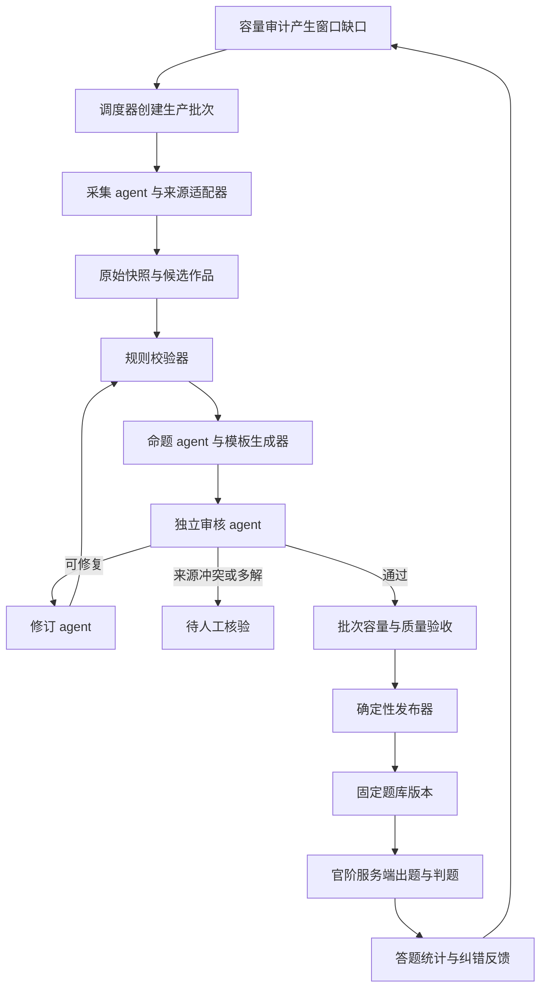

# 智能体题库引擎实施规划

日期：2026-09-18。状态：设计稿，未启动采集任务、模型调用或数据库迁移。

## 1. 目标与范围

建立可恢复、可审计、可持续扩容的诗词题库生产流程：按官阶缺口采集原文，生成题目，独立审核，修订复审，发布固定题目版本，持续监测质量。

首版覆盖现有三种题型：猜诗人、猜诗名、补下句；中文四选一。保留原有学段模式，不接支付、每日题或开放式赏析。新的官阶模式消费已发布题库。不依赖桌面 IDE 点击或交互会话长期在线。

已知基线：项目使用 Next.js、TypeScript、Prisma、SQLite。现有 Poem 表不记录来源、版本或审核状态；seed.mjs 按 ID 直接更新。已有官阶出卷与容量审计，但不是智能体生产系统。先前审计的 43 首、621 理论题面与全对到皇帝 805 道需求仅代表该次种子快照，后续每个批次重新计算。

## 2. 架构决策

一个持久化调度器，四个逻辑 agent，两个确定性执行器。agent 是受约束的模型任务角色，不必对应四个常驻进程，也不要求四种模型。



生产阶段可调用网络和模型；在线开局、抽题、判题不调用模型。保持 lib/games/ 纯函数边界，采集、模型与数据库代码放在该目录以外。

首版单节点：独立 Node worker + SQLite 持久化任务队列；网络任务可并发，数据库写事务保持短小。不在数据库事务中等待模型。暂不引入额外消息队列或微服务。

## 3. 分工、输入、输出和权限

| 角色 | 输入 | 必须输出 | 权限边界 |
| --- | --- | --- | --- |
| 调度器（程序） | 窗口缺口、来源策略、预算 | 批次、任务依赖、配额、状态 | 排队、暂停、重试；不能伪造审核结论 |
| 采集 agent | 缺少的时期/难度/作者配额 | 来源候选、作品候选、定位证据 | 仅通过来源适配器抓取；写候选区 |
| 命题 agent | 已核验原文及允许题型 | 题干、四选项、答案、证据引用、难度建议 | 不能修改核验原文或发布 |
| 审核 agent | 固定候选版本与原始证据 | 独立答案、逐项问题、通过/拒绝/待核验 | 第一遍不看预设答案与命题解释；不改题 |
| 修订 agent | 审核问题与证据 | 新候选版本、修改理由 | 不改来源事实；不得批准自身修订 |
| 规则校验器（程序） | 候选版本 | 结构、事实映射、选项、去重检查结果 | 硬失败不能被模型投票覆盖 |
| 发布器（程序） | 通过验收的清单及其哈希 | 不可变发布批次、激活指针、审计记录 | 唯一正式写库入口；不接受任意 SQL |

三种现有题型优先用模板从原文抽取答案；模型主要提出干扰项、难度和解释。不同审核模型可作为配置选项，但模型一致不是事实证据。模型返回结构化对象，由程序校验，不执行模型返回的脚本。

## 4. 来源与证据

采用来源注册表：sourceId、类型、地址、允许用途、许可记录、抓取规则、版本固定方式、启用状态。首批候选来源为上一轮核查过的 chinese-poetry；实际接入时固定 commit，复核选定目录及许可记录。网页搜索用于补缺与核查争议，不把搜索摘要直接转成题库正文。

每次采集保留不可变 Snapshot：来源 URI、commit/页面版本、抓取时间、内容哈希、文件路径或页码、原始文本。另存规范化文本和转换器版本；繁简转换、标点整理不得覆盖原文。原句的字符跨度或数组位置必须能回溯至快照。

同一资料的多个镜像不算独立来源。作者归属、异文或标题冲突进入待核验，不由模型按多数票改原诗。现代注释与翻译单独登记来源和使用条件，不随古诗正文自动放行。

联网适配器限制来源域名，校验重定向，限制大小、超时和请求速率；外部网页文字仅作为数据，不能修改 agent 指令或发布权限。任务记录不存密钥。

## 5. 数据模型与稳定身份

先增加候选/发布模型，保留 Poem、Player、GameSession 及旧种子导入路径。具体 Prisma 迁移在实施阶段编写。

| 实体 | 主要字段与约束 |
| --- | --- |
| Source | 来源策略、许可记录、版本策略、启用状态 |
| SourceSnapshot | sourceId、revision、hash、证据位置；同来源同 revision/hash 幂等 |
| Work / WorkVersion | 稳定作品 ID、作者/标题规范实体、版本正文、快照证据、核验状态；异文不静默覆盖 |
| Question / QuestionVersion | 稳定知识点 ID、版本号、题型、题干、固定选项、正确 optionId、证据、难度建议、contentHash |
| Review | questionVersionId、inputHash、角色、模型/提示版本、规则结果、证据、结论、时间 |
| PipelineRun / Task | 批次、阶段、输入哈希、状态、依赖、attempt、leaseToken、leaseUntil、预算预留与实际消耗 |
| Release / ReleaseItem | 不可变发布清单、规则版本、验收结果、清单哈希、固定 questionVersionId |
| ActiveRelease | 单行当前版本指针；支持比较旧指针后原子切换 |
| ContentIssue | 关联题目版本、反馈类型、复核状态、停用原因 |

Question 代表“同一个知识点”，QuestionVersion 代表编辑版本。换措辞、换选项、改难度不能生成新的知识点 ID。作品 ID 不直接取全文哈希，以免纠正错字后重置身份。

保留现有 sourceKey、faceKey 兼容，但正式去重使用稳定 questionId，并维护旧 key 到 questionId 的映射。另存规范化内容指纹与相似候选，阻止换 ID 导入同题；含异文的合并需保留依据。不得把“整首诗不能再出现”误当“同一道题不能再出现”。

玩家已见记录需持久化 questionId；开局即占用整卷。发布、撤回或更新版本不清除已见历史。现有题面身份包含答案，须留在服务端，不能作为前端透明标识。

## 6. 流程状态与恢复

候选版本状态：DRAFT → VALIDATING → REVIEWING → APPROVED；可分流至 NEEDS_REVISION、QUARANTINED 或 REJECTED。APPROVED 表示内容审核通过，不代表已发布。是否线上可用由发布清单与停用状态共同决定。

修订创建新版本并从 VALIDATING 重跑；原 Review 只对原 inputHash 生效。审核结果写入时核对哈希，发布前再次核对，阻止审核中修改后沿用旧批准。

任务状态：QUEUED、RUNNING、RETRY_WAIT、SUCCEEDED、FAILED、PAUSED。任务唯一键为阶段 + 输入版本哈希 + 规则/提示版本。worker 原子领取租约，心跳续租；结果提交必须匹配最新 leaseToken。崩溃后过期任务可重领，旧 worker 迟到结果不能覆盖新结果。

瞬时网络错误最多重试 3 次并退避；内容修订最多 2 轮，仍未通过进入待核验。运行和每任务都有 token/调用量预算，按最坏输出预留额度，耗尽进入 PAUSED 并报告已完成部分，不能无限重试。

## 7. 审核、优化与自动发布规则

每题硬门槛：

1. 来源已启用，快照可追溯，正文、作者、标题与选定版本证据一致。
2. 四选项规范化后唯一、类型一致、非空；正确 optionId 恰好对应一个选项。
3. 正确答案由核验原文和模板计算；审核 agent 独立解答结果一致。发现别名、同名作品、多出处成立的选项则拒绝或补足消歧上下文。
4. 题干与题前解释不泄露答案；以各题型允许字段白名单生成玩家响应。尤其猜作者/诗名时不能下发含答案的 poet/poemTitle 元数据，仅删除 answerIndex 不足以保密。
5. 重复知识点合并版本；语义近似题进入复核，不能只按字符串不同放行。
6. 难度由题型、熟悉度、干扰项相似度形成初始建议；现 grade 不直接等于实测难度。

首批用试运行校准：所有自动通过项做人工验收，记录错误原因和漏检率；验证之后，对已登记来源、无争议、模板可验证的三题型开放自动发布。新来源、主观题和争议版本留在待审区。此为拟定产品策略，实施时不应在每道常规题上新增临时权限确认。

自动发布只接受通过硬规则、审核、重复检查的固定版本；发布器在事务中写清单并切换指针。相同批次重试不产生第二份发布。回滚只切回先前清单，不删除玩家记录。缺题时可继续扩容，但不能自动降低审核门槛。

题目质量与全路径容量分别验收：合格但数量不足的批次可进入库存；只有容量门槛满足才激活对应官阶功能，避免把“有题发布”宣称为“完整官途可玩”。

## 8. 在线出题与发布衔接

官阶模式从固定发布版本的合格题中抽题，按题型/难度/目标窗口过滤，并排除已见 questionId。开局事务完成玩家资格检查、选题占用与会话快照；并发冲突重新选题。在线只打乱已审核选项顺序，答案以稳定 optionId 判定。

GameSession 保存题目版本、发布版本、选项映射与服务端答案快照；发布切换不影响已有正常对局。确认存在事实错误的题立即停用，对包含该题的活动局标记待处理/作废并允许重开，不清除已见历史，避免按已知错误答案判罚。具体补偿策略在接入阶段固化为事务规则。

保留 withCrypto、会话 TTL 和服务端判题；新管理接口另外做管理员认证和授权，加密不是权限验证。数据库不可用时官阶模式停止开局，不退回遗忘历史的内存模式。

## 9. 容量驱动与反馈

调度器按“官阶 × 研习/科考 × 题型 × 难度”的有效剩余量派任务，优先填真正短缺的窗口，避免只扩大总诗词数。为目标科考预留题量，避免研习先消耗完共享题目；预留规则必须参与真实出题回放。

首版容量验收建议：固定至少 20 个随机种子，覆盖 100%、80%、60% 正确率与每阶一次失败/弃局场景，逐局调用正式出题器直到皇帝。发布门槛要求目标场景无缺题；该测试只覆盖有限预算场景，不承诺无限重试永远有新题。

上线后收集题目曝光数、正确率、作答耗时、各干扰项选择率和反馈。样本不足不自动改难度；按玩家水平分组校准，避免把高阶玩家高正确率误判为简单题。难度/选项修改形成新版本并复审，不重置知识点身份。

批次报表：抓取量、证据合格率、规则/模型拒绝原因、修订通过率、各窗新增有效题、合格题调用成本、待核验队列、发布时间与回滚记录。置信分不能代替这些指标。

## 10. 项目目录与配置

建议新增（尚未创建）：

```text
src/lib/question-bank/
  contracts/       # 输入输出类型、运行时校验、状态转换
  sources/         # 注册表、快照、采集适配器
  agents/          # collect / compose / review / revise 及版本化提示
  providers/       # 模型适配器、超时、预算、结构化输出校验
  validators/      # 来源、选项、答案映射、身份、泄漏检查
  pipeline/        # 调度、租约、恢复、任务依赖
  publishing/      # 清单验收、激活、回滚
src/lib/db/question-bank-*  # 数据仓储与事务
scripts/question-bank/     # CLI、worker、审计与批次报告
tests/question-bank/       # 纯逻辑、临时库集成、固定样本验收
```

模型通过项目级适配器调用，复用可配置角色接口，不锁定厂商，也不以当前聊天中的临时子智能体充当长期服务。指定角色模型、单任务输出上限、批次预算、网络并发、来源白名单。模型凭据从进程环境读取，不写日志、任务提示或导出包。

拟定命令契约（规划，当前不可执行）：plan 计算配额；run 创建批次；worker 消费任务；report 导出结果；publish 激活已验收清单；rollback 切回已发布版本。首期 CLI 优先，稳定后再做审核管理页。

## 11. 里程碑与交付

| 阶段 | 交付 | 验收条件 |
| --- | --- | --- |
| P0 合同与样本 | 类型、状态机、来源规范、预算规则、固定正确/错误样本集 | 覆盖异文、别名、多答案、重复、答案泄漏与提示注入样本 |
| P1 确定性生产骨架 | 临时库 schema、队列租约、快照、模板命题、校验与版本清单；使用模拟 provider | 断点恢复、重复任务幂等、过期 worker 拒绝、事务发布/回滚测试通过 |
| P2 智能体试运行 | 四角色 provider、独立审核与修订闭环、100 首候选作品批次 | 生成证据和成本报表，先入测试库，首批逐题验收，失败项不强行放行 |
| P3 配额扩容与发布 | 按窗口扩容、正式发布器、重复映射、固定题目运行时适配 | 达到容量回放门槛，跨批次不重复，发布更新不影响已有会话 |
| P4 管理与反馈 | 候选/待审/发布页、纠错、难度校准、周期调度 | 实际浏览器验证审核/发布/撤回，角色权限、题前答案保密验收通过 |

实际开发从 P0/P1 开始；先把无需模型就能验证的管线完成，再接真实采集与模型调用。P2 的 100 首是试运行规模，不是题库容量承诺。正式库迁移前用临时库验证，并制定保留现有 Poem、玩家与对局数据的增量迁移方案。

## 12. 本次交付边界

本次仅创建规划文档，未创建运行中的智能体、未抓取题库、未调用付费模型、未迁移或写入正式数据库。后续可依本规划分阶段实现，不应将此文档或模型角色定义当成已运行的自动生产系统。
